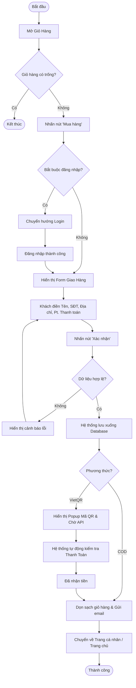
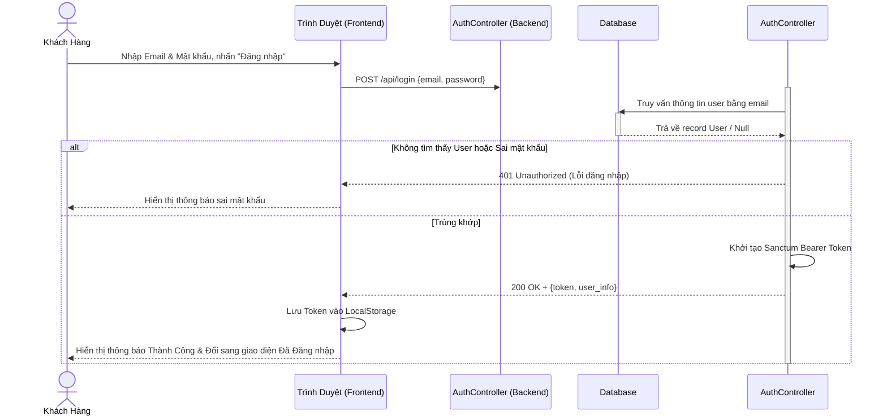
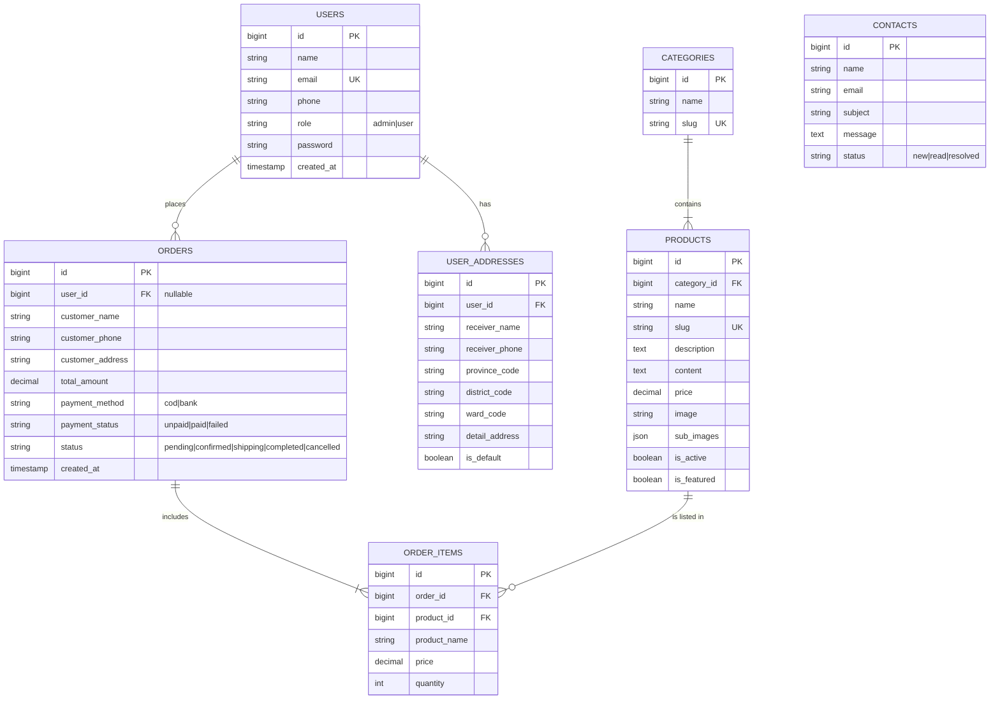

# CHƯƠNG 3: THIẾT KẾ HỆ THỐNG

Chương này trình bày chi tiết về thiết kế hệ thống của website bán bánh La Pâtisserie (Golden Bakery), bao gồm từ mức tổng quan đến chi tiết luồng xử lý và mô hình dữ liệu. Hệ thống được mô hình hóa bằng các sơ đồ cơ bản theo tiêu chuẩn UML (Unified Modeling Language).

## 3.1. Sơ đồ Use Case (Use Case Diagram)

Sơ đồ Use Case thể hiện tương tác giữa các tác nhân (Actor) và hệ thống, nhằm xác định rõ các chức năng mà hệ thống cung cấp cho từng nhóm người dùng. Hệ thống có 2 tác nhân chính:
1. **Khách hàng** (Đã đăng nhập/Chưa đăng nhập)
2. **Quản trị viên (Admin)** 

### 3.1.1. Sơ đồ Use Case tổng quan

```mermaid
usecaseDiagram
    actor Khách hàng as Customer
    actor Admin as Admin

    package "Hệ Thống La Pâtisserie" {
        usecase "Xem danh sách sản phẩm" as UC1
        usecase "Tìm kiếm & Xem chi tiết" as UC2
        usecase "Quản lý giỏ hàng" as UC3
        usecase "Thanh toán/Đặt hàng" as UC4
        usecase "Quản lý tài khoản (Profile)" as UC5
        usecase "Theo dõi đơn hàng" as UC6
        usecase "Liên hệ hỗ trợ" as UC7
        
        usecase "Quản lý sản phẩm & danh mục" as UCA1
        usecase "Quản lý đơn hàng" as UCA2
        usecase "Quản lý người dùng" as UCA3
        usecase "Xem thống kê & báo cáo" as UCA4
    }

    Customer --> UC1
    Customer --> UC2
    Customer --> UC3
    Customer --> UC4
    Customer --> UC5
    Customer --> UC6
    Customer --> UC7

    Admin --> UCA1
    Admin --> UCA2
    Admin --> UCA3
    Admin --> UCA4
```

## 3.2. Đặc tả Use Case (Use Case Specification)

Dưới đây là màn đặc tả chi tiết cho 2 Use Case quan trọng nhất của hệ thống: Đặt hàng (Checkout) và Quản lý Sản Phẩm.

### Đặc tả UC4: Thanh toán / Đặt hàng
- **Tên Use Case:** Thanh toán đơn hàng (Checkout)
- **Tác nhân:** Khách hàng (Bao gồm cả khách chưa đăng nhập / vãng lai).
- **Mô tả:** Chức năng cho phép người dùng xác nhận thông tin giao nhận và thanh toán để hoàn tất quá trình mua các sản phẩm trong giỏ hàng.
- **Tiền điều kiện:** Giỏ hàng của khách hàng phải có ít nhất 1 sản phẩm.
- **Luồng sự kiện chính:**
  1. Người dùng chọn "Thanh toán" từ giỏ hàng.
  2. Hệ thống hiển thị form nhập thông tin giao hàng (Tên, Số điện thoại, Địa chỉ, Email...). Nếu khách đã đăng nhập, hệ thống tự điền sẵn dữ liệu.
  3. Người dùng chọn phương thức thanh toán (COD hoặc Chuyển khoản VietQR) và thời gian giao nhận.
  4. Người dùng bấm "Xác nhận đặt hàng".
  5. Hệ thống lưu đơn hàng vào CSDL với trạng thái thiết lập ban đầu (VD: `pending`).
  6. Hệ thống tạo và gửi Email xác nhận. Hiển thị mã QR nếu là hình thức chuyển khoản.
  7. Hệ thống chuyển khách hàng về trang chủ (Khách vãng lai) hoặc trang lịch sử (Khách đã đăng nhập) và làm trống giỏ hàng.
- **Xử lý ngoại lệ:** Nếu khách hàng nhập thiếu thông tin bắt buộc (Địa chỉ, SĐT...), hệ thống sẽ cảnh báo đỏ và yêu cầu nhập lại, không cho phép tiếp tục.

### Đặc tả UCA1: Quản lý sản phẩm
- **Tên Use Case:** Quản lý sản phẩm
- **Tác nhân:** Quản trị viên (Admin)
- **Mô tả:** Chức năng giúp quản trị viên thêm mới, chỉnh sửa thông tin, hoặc xóa sản phẩm khỏi cửa hàng.
- **Tiền điều kiện:** Admin đã đăng nhập thành công và được cấp quyền truy cập khu vực Dashboard.
- **Luồng sự kiện chính (Ví dụ chức năng Thêm Mới):**
  1. Admin chọn chức năng "Thêm sản phẩm mới" từ Menu.
  2. Hệ thống hiển thị Form điền thông tin (Tên bánh, mô tả, danh mục, giá, ảnh đại diện).
  3. Admin điền thông tin và tải ảnh lên hệ thống, sau đó nhấn "Lưu".
  4. Hệ thống kiểm tra tính hợp lệ, lưu tệp hình ảnh vào thư mục `public/uploads` và chèn bản ghi vào bảng `Products`.
  5. Hệ thống thông báo thành công và cập nhật lại danh sách.

---

## 3.3. Sơ đồ Hoạt động (Activity Diagram)

Sơ đồ hoạt động diễn tả luồng thực thi cụ thể của một quy trình trong hệ thống. Dưới đây là Sơ đồ hoạt động cho quy trình mua hàng.

### Sơ đồ quy trình Thanh toán & Đặt hàng (Checkout Flow)



---

## 3.4. Sơ đồ Tuần tự (Sequence Diagram)

Sơ đồ tuần tự thể hiện các đối tượng tương tác với nhau theo trình tự thời gian.

### Luồng Tương tác: Khách hàng Đăng nhập hệ thống



---

## 3.5. Sơ đồ Quan hệ Thực thể (Entity-Relationship Diagram - ERD)

Sơ đồ ERD mô tả cấu trúc vật lý của cơ sở dữ liệu, thể hiện các thực thể (Bảng) và mối liên kết (Khoá ngoại) của chúng trong hệ thống Laravel. Hệ thống gồm 7 đối tượng trọng tâm sau:



### Chú thích các Liên kết cơ sở dữ liệu:
*   Mỗi **Category** (Danh mục) có thể chứa nhiều **Products** (Sản phẩm) `[1 - n]`.
*   Một **User** (Người dùng) có thể có nhiều **UserAddresses** (Địa chỉ) và khởi tạo nhiều **Orders** (Đơn hàng) `[1 - n]`.
*   Bảng **Orders** chấp nhận `user_id` là rỗng (nullable) để phục vụ cho các Khách Hàng vãng lai đặt đơn.
*   Mỗi **Order** chứa một hoặc nhiều **OrderItems** (Chi tiết đơn hàng).
*   Mỗi **OrderItem** tham chiếu cụ thể tới một thông tin bảng **Products** tại thời điểm chọn mua. Bảng này lưu lại cả thông tin giá và tên tại thời điểm chốt đơn đề phòng việc sản phẩm trên hệ thống bị thay đổi sau này.
*   Bảng **Contacts** hoạt động độc lập nhằm lưu trữ các lời nhắn gửi về từ trang Liên hệ của trình duyệt.
